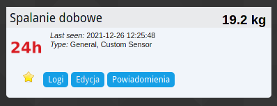
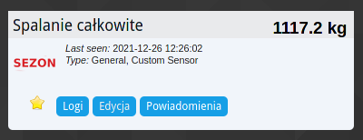
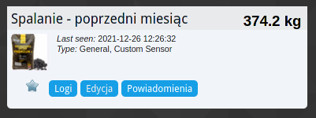
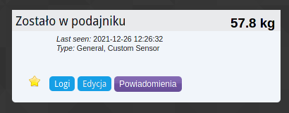
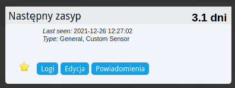
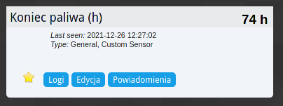
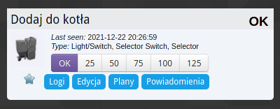
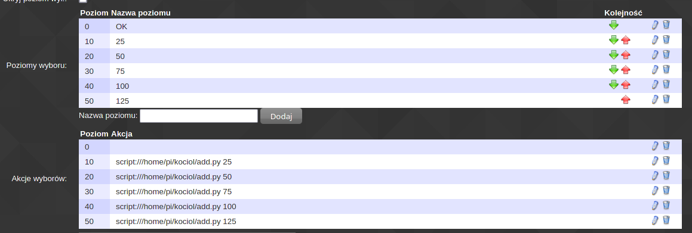

*NOTE: This readme is currenly available only in polish. You can check `README_OLD_EN.md` for english version, but installation instructions there are really low quality*

# Instalacja i konfiguracja
## Baza PostgreSQL
### Instalacja
```bash
sudo apt update
sudo apt install postgresql
```
Należy potwierdzić instalację wpisując `Y` (lub `T` w polskiej wersji językowej)  
Może wyświetlić się czerwony tekst mówiący że baza nie jest uruchomiona - nie trzeba się tym martwić
### Konfiguracja
```bash
sudo su - postgres
createuser --pwprompt kociol_user
```
Należy wprowadzić i zapisać/zapamiętać hasło do bazy danych
```bash
createdb --encoding=UTF8 --owner=kociol_user kociol
psql -h localhost -d kociol -U kociol_user
```
Powinien wyświetlić się napis `kociol=>`, należy wpisać: (i zatwierdzić enterem)
```sql
CREATE TABLE test_table (
	measurement_id SERIAL PRIMARY KEY,
	measurement_time timestamp,
	measurement integer
);

CREATE TABLE tray_table (
   add_id SERIAL PRIMARY KEY,
   add_time timestamp,
   added integer
);
```
Powinno wyświetlić się:
```sql
CREATE TABLE
CREATE TABLE
```
Należy wpisać (dwa razy)
```bash
exit
exit
```

## Skrypt do kotła
### Instalacja
Najpierw należy pobrać potrzebne zależności:
```
sudo apt install git python3 python3-pip
```

Najłatwiej kod będzie pobrać z githuba (polecenie utworzy folder `kociol` w aktualnym folderze):
```bash
git clone https://github.com/maciej-home/kociol
cd kociol
```
Ewentualnie można użyć edytora (np. `nano`) i skopiować zawartość plików

Należy zezwolić na uruchamianie skryptu "dodającego węgiel do podajnika":
```bash
chmod +x add.py
```

Należy również pobrać potrzebne moduły pythona:
```
pip install -r requirements.txt
```

### Konfiguracja

#### Domoticz
Należy stworzyć w domoticzu urządzenia tak jak na screenach:
`domoticz_last24h_idx`  
  
`domoticz_season_idx`  
  
`domoticz_previous_month_idx`  
  
`domoticz_left_in_tray_idx`  
  
`domoticz_left_days_idx`  
  
`domoticz_left_hours_idx`  
  
`domoticz_add_switch_idx`  
  
  

#### Plik konfiguracyjny

Należy edytować plik `config.py`, na przykład edytorem `nano`:
```
nano config.py
```
Należy zamienić wartości:
`ratio` - kilogramy węgla wrzucane na każdy impuls - najprościej dojść do tego metodą prób i błędów  
`db_pass` - hasło do bazy danych  
`*_idx` - na idx odpowiednich urządzeń stworzonych w domoticzu

#### Zapisywanie impulsów
Należy uruchomić skrypt `main.py` w sposób `main.py <wartość>`, gdzie `wartość` to aktualna ilość impulsów odczytana z czujnika  

W wypadku korzystania z oryginalnego skryptu iNode można to zrobić wstawiając linię
```
python3 /home/pi/kociol/main.py $DECIM
```
po fragmencie:
```
HEXIM=`echo $mp  | awk '{ print $10$9$8$7 }'`
#echo TOTAL POWER $HEXIM
DECIM=`echo "ibase=16; $HEXIM"|bc`
#echo TOTAL POWER $DECIM
CALCIM=`echo $DECIM $CONST | awk '{ kWh=($1/$2); printf"%0.3f\n", kWh  }'`
#echo CALCIM $CALCIM
TODOMOTICZ=`echo $CALCIM | sed -r 's/\.//g'`
```
Jeśli kod został pobrany/skopiowany do innego folderu, należy zmienić ścieżkę `/home/pi/kociol/main.py` na odpowiednią
